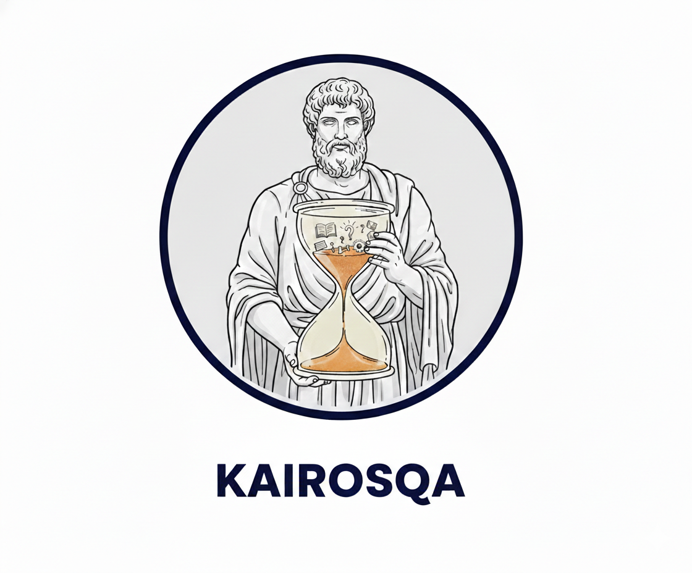

# Kairos project

[](https://arxiv.org/abs/2605.22769)
[](https://huggingface.co/collections/kyutai/kairos)
[](https://opensource.org/licenses/MIT)
[](https://kyutai.org/blog/2026-05-26-kairos)

This repository contains the code required to reproduce most of the experiments from the paper
**_Understanding Data Temporality Impact on Large Language Models Pre-training_**.

You can evaluate our checkpoints — as well as other HuggingFace base models — on **KairosQA** and additional benchmarks such as [OLMES](https://arxiv.org/abs/2406.08446) and [TAQA](https://arxiv.org/abs/2402.16797).

---

## 🗂️ Table of Contents
- [Installation](#installation)
- [Base Models](#base-models)
- [Preparing Datasets](#preparing-datasets)
- [Folder Structure](#folder-structure)
- [Evaluation](#evaluation)
- [Citation](#citation)
- [Acknowledgments](#acknowledgments)

---

## Installation

### 1️⃣ Clone this repository
```sh
git clone git@github.com:kyutai-labs/kairos.git
cd kairos
```

Set the different paths in your own `.env` file as explained in `.env.example`.

### 2️⃣ Install dependencies

We recommend using [`uv`](https://docs.astral.sh/uv/) to manage the environment.
It is significantly faster than `pip` and automatically resolves dependencies from `pyproject.toml`.

After installing `uv`, you do **not** need to manually install packages:
simply prefix every command with `uv run`.

Example:
```sh
uv run python ...
```

---

### Installing without `uv`

If you prefer `pip`, you will need **Python ≥ 3.11**.

We strongly recommend using a virtual environment:

```sh
python -m venv .venv
source .venv/bin/activate
pip install -e .
```

(or Conda / virtualenv if preferred)

---

## Base Models

### Helium-6B models
<p align='center'>
  
</p>

We provide several versions of **Helium-6B** checkpoints trained with different temporal ordering strategies.

👉 https://huggingface.co/kyutai/Sequential_Helium_6B

These models can be used:
- as open-source base models
- for evaluation on KairosQA
- or for continued training

---

## Preparing Datasets

### KairosQA
<p align='center'>
  
</p>

The primary benchmark used in this work is **KairosQA**:

👉 https://huggingface.co/kyutai/KairosQA

To download the datasets:

```bash
uv run python scripts/data/download_kairosqa.py
uv run python scripts/data/download_taqa.py
uv run python scripts/data/download_olmes.py
```

`download_olmes.py` accepts `--only arc_challenge,mmlu` to download a subset.
All scripts write into `$DATA_DIR` defined by the .env (defaults to `./data`).

---

## Folder Structure

```
kairos/
 ├── evaluate.py      # Main evaluation entry point
 ├── data/            # KairosQA creation + tokenization
 ├── evaluation/      # Evaluation pipeline
 │   └── olmes/       # OLMES benchmark implementation
 ├── inference/       # Inference code for Helium
 ├── nn/              # Helium architecture
 └── utils/
```

---


## Evaluation

Supported benchmarks:
- KairosQA
- OLMES
- TAQA

To run the evaluations on all our checkpoints and other open-source models, submit each benchmark as a separate SLURM array job:

```bash
sbatch scripts/launch_kairosqa.sh   # KairosQA (multiple-choice + cloze + generative, all years)
sbatch scripts/launch_olmes.sh      # OLMES
sbatch scripts/launch_taqa.sh       # TAQA
```

All three scripts share the same `MODELS` array — edit it once per script to add/remove models, and adjust `--array` / `--partition` / `--job-name` for your cluster.

---


### Creation of KairosQA

Once the WikiData dump has been extracted and filtered, create a filtered dictionary of subject and then generate questions:

```bash
uv run python kairos/data/create_evals.py \
    --data_path PATH_OF_DUMP \
    --filter_subdict
```

To quickly test a model or have a deeper look at KairosQA dataset (or even to your homemade KairosQA dataset), please find `./kairos/inference/interactive_temporal.py` and run:

```bash
uv run python kairos/inference/interactive_temporal.py \
    --model 'kyutai/Sequential_Helium_6B' \
```

---
## Licenses

The present code is provided under the MIT license. The model weights for the different checkpoints as well as KairosQA dataset are released under the CC-BY 4.0 license.

---


## Citation

If you use this work, please cite:

```bibtex
@misc{pilchen2026understandingdatatemporalityimpact,
      title={Understanding Data Temporality Impact on Large Language Models Pre-training},
      author={Hippolyte Pilchen and Romain Fabre and Franck Signe Talla and Patrick Perez and Edouard Grave},
      year={2026},
      eprint={2605.22769},
      archivePrefix={arXiv},
      primaryClass={cs.CL},
      url={https://arxiv.org/abs/2605.22769},
}
```
